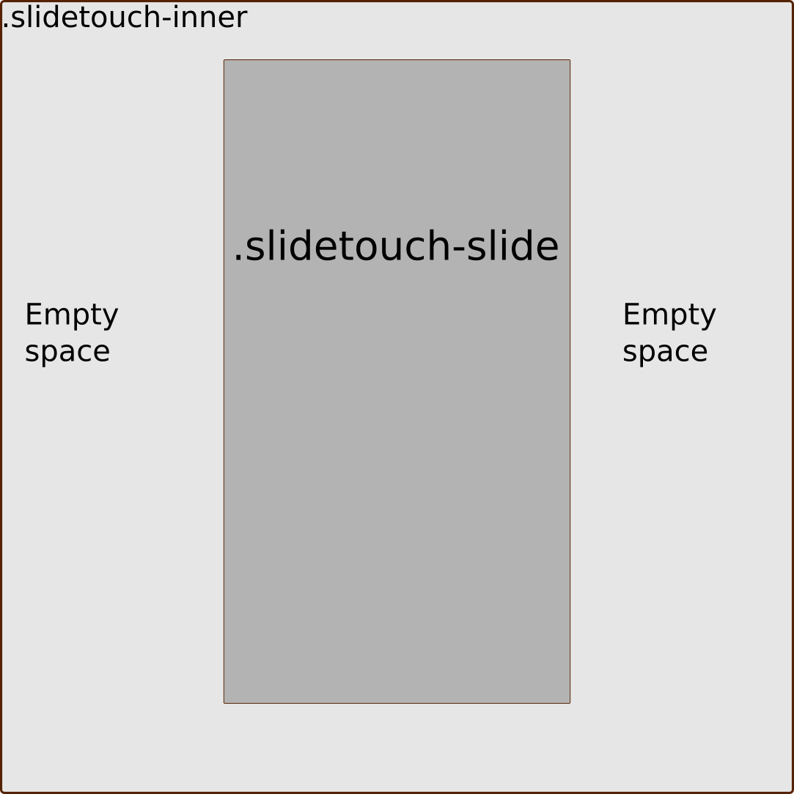

# Touchslide 
## Princess Polly inspiration

It is a carousel inspired by princess polly website.

It use
* JavaScript
* ResizeObserver
* IntersectionObserver
* mousedown, mousemove, mouseup, mouseleave, touchstart, touchmove, touchend

## The function halfEmptyspace
It substract the .slidetouch-slide width from .slidetouch-inner
This value is used in the options object of IntersectionObserver

<!--  -->

